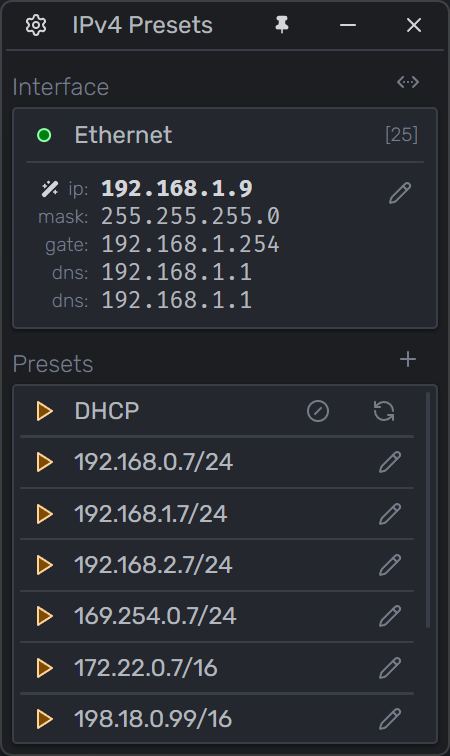
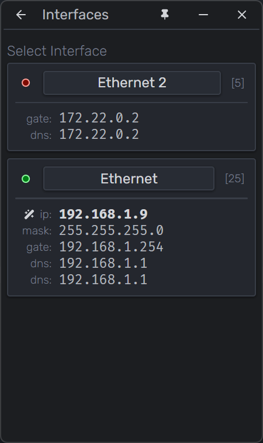
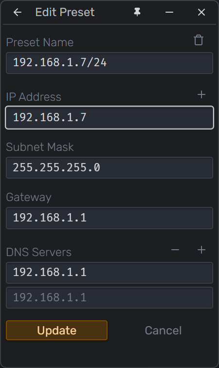
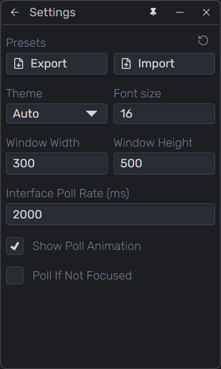
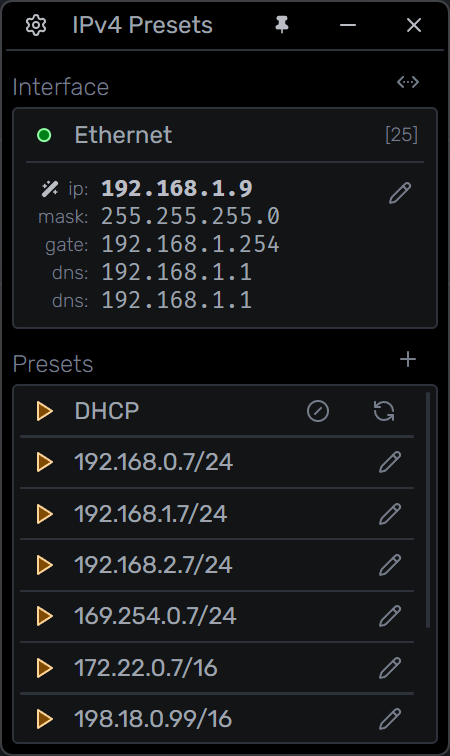
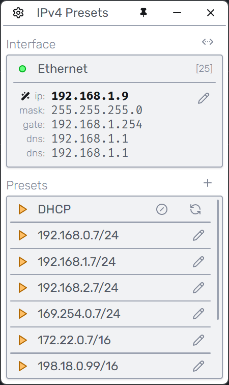

# README

Quickly change and save network IPv4 settings


## Download

Windows (portable): [ip-tool-v0.4.exe](https://github.com/treytiderman/ip-tool/releases/download/v0.4/ip-tool-v0.4.exe)


## Screenshots














## Ideas

- [x] Add css themes
- [x] Add DHCP functions renew, release
- [ ] Add CIDR input of Subnet Mask if starts with "/"
- [ ] Add disable/enable interfaces
- [ ] Add logging for each netsh command
- [ ] Add set interface metric
- [ ] Add set routes like netrouteview
- [ ] Add confirm dialog to replace built-in window.confirm()
- [ ] Add network scanner
- [ ] Add mDNS discovery
- [ ] [Auto Update](https://github.com/wailsapp/wails/issues/1178#issuecomment-3448430708)
- [x] Add settings page
    - [ ] Be able to change/add filters to interfaces
    - [x] Add poll interfaces time control
    - [x] Add setting for when to poll interfaces (focused, minimized)
    - [x] Add reset presets button
    - [x] Add export/import presets button
    - [ ] Add export logs button


## Dev

Run `wails dev`


## Build

```sh
# Run 
wails build

wails build -clean -devtools -o ip-tool-v0.4.exe

# deletes build/bin
wails build -clean
 
wails build -devtools

# default option. asks to install webview
wails build -webview2 download

# if no webview then it opens the browser to the download page
wails build -webview2 browser

# doesnt work?
wails build -webview2 embed

wails build -o ip-tool-v0.x.exe
```


## Go Tests

```sh
# Run
go test
```


## Always start as Administrator

Add the "<trustInfo>" section to wails.exe.manifest

```xml
<?xml version="1.0" encoding="UTF-8" standalone="yes"?>
<assembly manifestVersion="1.0" xmlns="urn:schemas-microsoft-com:asm.v1" xmlns:asmv3="urn:schemas-microsoft-com:asm.v3">
    <assemblyIdentity type="win32" name="com.wails.{{.Name}}" version="{{.Info.ProductVersion}}.0" processorArchitecture="*"/>
    <dependency>
        <dependentAssembly>
            <assemblyIdentity type="win32" name="Microsoft.Windows.Common-Controls" version="6.0.0.0" processorArchitecture="*" publicKeyToken="6595b64144ccf1df" language="*"/>
        </dependentAssembly>
    </dependency>
    <asmv3:application>
        <asmv3:windowsSettings>
            <dpiAware xmlns="http://schemas.microsoft.com/SMI/2005/WindowsSettings">true/pm</dpiAware> <!-- fallback for Windows 7 and 8 -->
            <dpiAwareness xmlns="http://schemas.microsoft.com/SMI/2016/WindowsSettings">permonitorv2,permonitor</dpiAwareness> <!-- falls back to per-monitor if per-monitor v2 is not supported -->
        </asmv3:windowsSettings>
    </asmv3:application>
    <trustInfo xmlns="urn:schemas-microsoft-com:asm.v3">
        <security>
            <requestedPrivileges>
                <requestedExecutionLevel level="requireAdministrator" uiAccess="false"/>
            </requestedPrivileges>
        </security>
    </trustInfo>
</assembly>
```

Adding the "windows" key to wails.json did not work

```json
{
  "$schema": "https://wails.io/schemas/config.v2.json",
  "name": "ip-tool",
  "outputfilename": "ip-tool",
  "frontend:install": "npm install",
  "frontend:build": "npm run build",
  "frontend:dev:watcher": "npm run dev",
  "frontend:dev:serverUrl": "auto",
  "author": {
    "name": "Trey Tiderman",
    "email": "tiderman.trey@gmail.com"
  },
  "windows": {
    "webview2": "browser",
    "rtl": false,
    "disableWindowIcon": false,
    "darkMode": true,
    "theme": "system",
    "messages": {
      "runtimeNotInstalled": "You need to install the WebView2 runtime to run this application. Would you like to download it now?",
      "webview2DownloadError": "Failed to download the WebView2 runtime. Please check your internet connection.",
      "webview2InstallationError": "Failed to install the WebView2 runtime. Please try again or install it manually."
    },
    "executionLevel": "requireAdministrator"
  }
}
```

