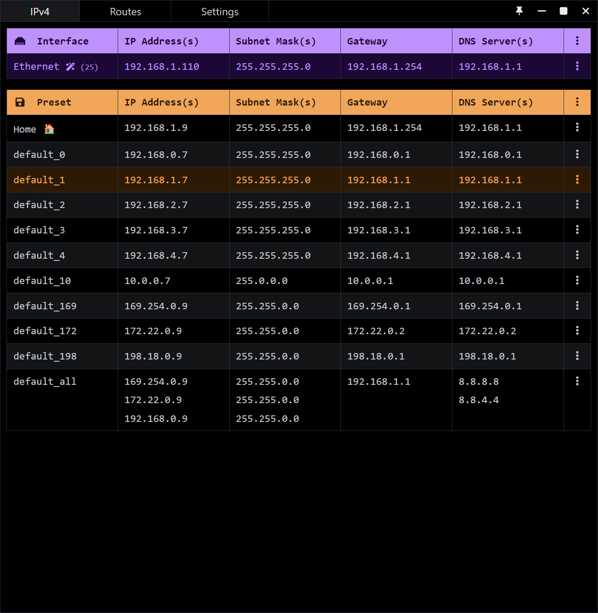
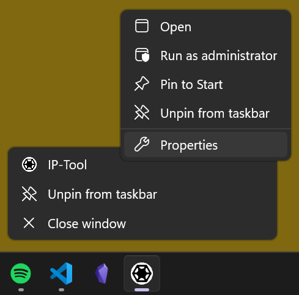
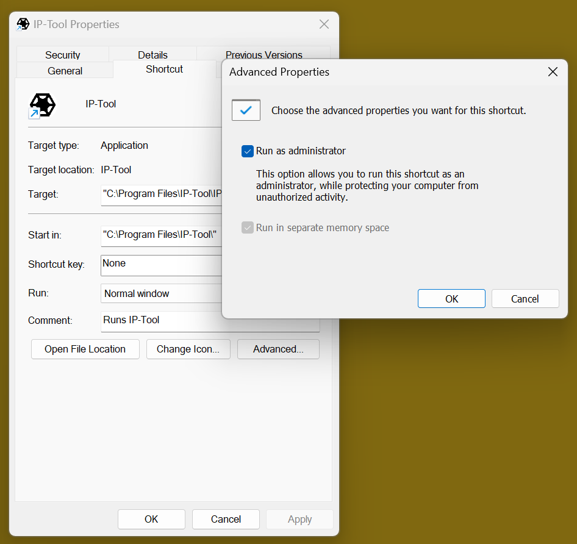

# IP Settings / Presets (Windows)

Quickly change and save network settings.
For people that plug into a lot of networks

### Download

[Installer](https://github.com/TreyTiderman/IP-Tool/releases/download/v0.3.0/IP-Tool_0.3.0_Installer.msi)
/
[Portable](https://github.com/TreyTiderman/IP-Tool/releases/download/v0.3.0/IP-Tool_0.3.0_Portable.exe)



# Set to always run as Administrator

Go to the shortcuts properties 



Then to Shortcut > Advanced... > Run as administrator



# Source Code

### Setup

https://tauri.app/v1/guides/getting-started/prerequisites

```
npm install
```

### Run

```
npm run tauri dev
```

### Build

```
npm run tauri build
```

### Svelte Only

```
npm run dev
```

# Notes

### TODO

- [x] Alternating colors shift with contextmenu
- [x] Interface friendly name change
- [x] Confirm edit with enter
- [ ] Row moving
- [ ] Table sorting
- [x] Routes page View
- [ ] Routes page Edit
- [ ] Hide interface
- [ ] More options to add presets
- [ ] Network Scan page
- [ ] Default Subnet to 255.255.255.0

### Network Scan

https://crates.io/crates/netscan

### Force Admin

https://github.com/nabijaczleweli/rust-embed-resource#example-embedding-a-windows-manifest

### Logging?

https://github.com/tauri-apps/tauri-plugin-log

### Add to `tauri.conf.json` for offline install of WebView2

```json
{
  "tauri": {
    "bundle": {
      "windows": {
        "webviewInstallMode": {
          "type": "offlineInstaller"
        }
      }
    }
  }
}
```
